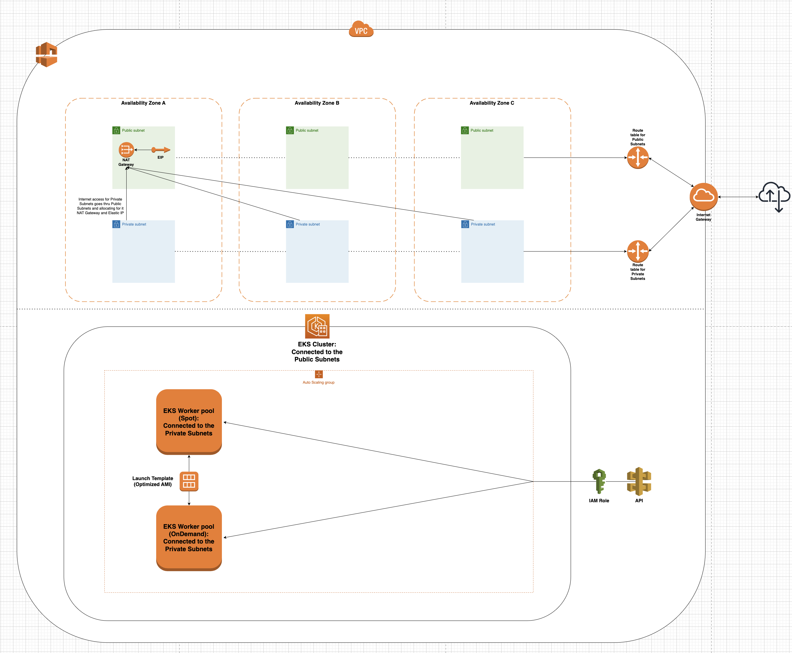

## Plan to create infra in AWS

Amazon EKS cluster on AWS using Terraform modules. The cluster must use Kubernetes version v1.23, contain at least 1 t3.medium instance and 2-4 mixed spot and on-demand instances, have multi-AZ nodes, and be placed in a new VPC with 3 public and 3 private subnets. Security Groups must be locked down, and nodes must be configured via ASG. 

The deliverables include a functioning EKS cluster, supporting screenshots, and a README with usage instructions and any challenges faced.



## Terraform tree structure:

```
└── aws-eks-cluster
    ├── terraform
    │   ├── env
    │   │   ├── dev.tfvars
    │   │   └── prod.tfvars
    │   ├── main.tf
    │   ├── outputs.tf
    │   ├── versions.tf
    │   └── variables.tf          
    └── modules
        ├── eks
        │   ├── eks.tf
        │   ├── iam.tf
        │   ├── outputs.tf
        │   ├── user-data.tlp
        │   ├── versions.tf
        │   └── variables.tf	
	      └── vpc-tf
            ├── vpc.tf
            ├── outputs.tf
	          ├── versions.tf
            └── variables.tf
       
```

## Services available:

-   VPC creation goal: proper configured VPC with all required components for the EKS cluster. Resources in Terraform [vpc.tf](./terraform/modules/vpc/vpc.tf):

1.  Resource VPC creating with parameters:
    1.  `cidr_block` = in what zone we would create our VPC.
    2.  `instance_tenanacy` set to “default” - it makes our instances shared on the host.
    3.  `enable_dns_support` and `enable_dns_hostnames` = true. It’s required for our EKS cluster.
2.  Internet Gateway: that allows communication between instances in a VPC and the internet.
3.  Route Table for Public Subnets: is used to determine where network traffic is directed within a VPC. Each subnet in a VPC must be associated with a route table, which contains a set of rules, known as routes, that determine where network traffic is sent.
4.  Main Route Table Association: is used to explicitly associate the main route table with a public subnets. This is useful for custom routing, separating private and public subnets.
5.  Public Subnets: as our task were declare to create 3 public subnets. Creating public subnets in different AZs in VPC is a best practice that can help increase availability, improve performance, enhance security, and support load balancing. Passing parameter `map_public_ip_on_launch = true` make our subnets actual public and they will have public IPs.
6.  Resource `aws_route_table_association`: will allocate our public subnets with route table created before.
7.  Private Subnets: as our task were declare to create 3 private subnets. Parameter `map_public_ip_on_launch` set to false.
8.  Route Table for Private Subnets: it’s best practice to keep separate route tables, because of several reasons such as performance and management our VPC. Also it’s improving our security to make them separately.
9.  Route Table assosiation with our private subnets.
10.  NAT gateway along with Elastic IP: needed for our private subnets to have an access into the internet.
11.  Under [vpc.tf](./terraform/modules/vpc/vpc.tf) I’ve also created security group, both we will need for our EKS cluster. One will be for master node and other for worker nodes. Configured with proper rules, inside the code you will find each role along with describtion why we need it.
12. Tag specification. Those taggs attached to the subnets are required for Kubernetes. They used to indicate that the resource is associated with a particular EKS cluster. The value of this tag is set to the name of the EKS cluster (in this case, the value is set to the value of the `"var.cluster_name"` variable). By setting this tag, you can easily identify which resources are associated with which EKS cluster.
13. The second tag, `"kubernetes.io/role/elb" = "1"`, is used to indicate that the resource (again, an Elastic Load Balancer) has a specific role within the Kubernetes cluster. In this case, the value of the tag is set to `"1"`, which indicates that the load balancer is an external load balancer that is managed by Kubernetes.

-   IAM roles creation goal [iam.tf](./terraform/modules/eks/iam.tf): create two roles with suitable policies for EKS cluster and self-managed nodes.

**Policies that I’ve attached to EKS cluster role:**

1.  `AmazonEKSClusterPolicy`: This policy grants the IAM role permissions to manage EKS clusters, including creating, updating, and deleting clusters. It also allows the role to describe and list the resources associated with a cluster, such as worker nodes and endpoint resources.
2.  `AmazonEKSVPCResourceController`: This policy allows the IAM role to create and manage resources that are required by the EKS VPC CNI plugin, which is responsible for networking and security for pods running in the EKS cluster. This policy is necessary to allow the role to create and manage elastic network interfaces (ENIs) and other resources associated with the plugin.
3.  `AmazonEKSServicePolicy`: This policy allows the IAM role to create and manage AWS resources that are required by EKS, such as load balancers and Auto Scaling groups. It also allows the role to describe and list the resources associated with these services.
4.  `AllowExternalDNSUpdatesPolicy`: This policy is a custom policy that allows the IAM role to modify DNS records in an external DNS server, such as Route53, which is commonly used for Kubernetes cluster DNS management. Policy created by Dan.

**Policies that I’ve attached to self-managed nodes role:**

1.  `AmazonEKSWorkerNodePolicy`: This policy grants the IAM role that is associated with the EC2 instances that run the self-managed worker nodes the permissions necessary to register with the EKS control plane and join the cluster. The policy also allows the worker nodes to access EKS-related resources, such as CloudWatch logs and the EKS endpoint.
2.  `AmazonEKS_CNI_Policy`: This policy provides the required permissions for the self-managed worker nodes to communicate with the AWS VPC CNI plugin, which is responsible for networking and security for pods running in the EKS cluster. This policy allows the worker nodes to create and manage elastic network interfaces (ENIs) and other resources associated with the plugin.
3.  `AmazonEC2ContainerRegistryReadOnly`: This policy grants the self-managed worker nodes read-only access to the Amazon ECR registry, which is necessary to pull container images when running workloads in the EKS cluster.
4.  `EC2InstanceProfileForImageBuilderECRContainerBuilds`: is used to grant permission to the self-managed worker nodes to push and pull images from an Amazon ECR registry using the EC2 Instance Connect feature.

-   EKS cluster creation goal [eks.tf](./terraform/modules/eks/eks.tf): functioning cluster, launch template configuration for our node instances, auto-scalling group for self-managed nodes.

1.  EKS cluster resource: passing parameters such as name, role_arn (that we created in previous step), version of kubernetes cluster, dependencies to make sure that role will create first and then cluster. VPC_config with parameters subnet_ids and security group, making value thru vars because those values were created in another module.
2.  Extracting (in data block) Amazon Linux AMI is built on top of Amazon Linux 2, and is configured to serve as the base image for Amazon EKS nodes. The AMI is configured to work with Amazon EKS and it includes the following components: 
3.  Then we are creating our launch template for the node instances and we will use AMI that we extract in data block. Before that we may also need user_data.tlp file created that will contain user data for our node instances and will set up for us shell script in a boot stage. `iam_instance_profile` block will attach our node role for instances.
4.  The `user_data` script is necessary for properly setting up the EC2 instances in an EKS cluster and enabling them to participate in the cluster's Kubernetes environment. Without it, the EC2 instances would not be properly configured and would not be able to join the EKS cluster. The script performs the following actions:
    1. Connects to the EKS cluster's Kubernetes API server using the --apiserver-endpoint option.
    2. Retrieves the cluster's CA certificate from the Kubernetes API server using the --b64-cluster-ca option.
    3. Joins the worker node to the EKS cluster by running the kubelet and kube-proxy Kubernetes components with appropriate configuration.
5.  `aws_autoscaling_group`: will create EC2 instances for our that will perfectly fit to our cluster as self-managed nodes. `mixed_instances_policy` calls to pass our launch template and down there we’re configuring `instances_distribution` that will do for us OnDemand instances and Spot instances.
6.  Cluster authentication in data block where we are creating ConfigMap (before that I add kubernetes provider in our [main.tf](./terraform/main.tf). ConfigMap it’s required kubernetes configuration to join worker nodes via AWS IAM role authentication. We will have our ConfigMap in a output when all resources will be applied. This config map we should create in already created cluster inside. Using `kubectl apply -f` , then if you do `k get nodes -w` you can see how’s nodes attaching to the cluster in real time.
7. Tag specification. `"kubernetes.io/cluster/${var.cluster_name}"` and value `"owned"`, is a Kubernetes system tag that is used to identify resources that are owned by a particular EKS cluster. The value of the tag is set to `"owned"`, which means that the resource is owned and managed by the EKS cluster identified by the `"var.cluster_name"` variable. By setting this tag, you can easily identify which resources are owned and managed by your EKS cluster.
8. `"propagate_at_launch"` set to true, which means that the tags will be applied to any resources launched within the EKS cluster. This helps ensure that all resources associated with your EKS cluster are properly labeled and organized.

**Notes:** 

1. Tags are required and important because they provide a way to label and organize your resources in a way that makes it easier to manage and understand your infrastructure, and they ensure that all resources associated with your EKS cluster are properly labeled and organized.

2. To check whether instance OnDemand or Spot we can thru AWS console. Under "Detail" on instance, there is Lifecycle: spot or normal.  

## Debugging:

1.  After I created VPC module, I was wondering how can I reference values that I will need to the EKS module. In this case, you may need to create an output (let’s grab an example in case of IDs of public subnets) in VPC module in [outputs.tf](./terraform/modules/vpc/outputs.tf):

```yaml
output "public_subnets_ids" {
  value = aws_subnet.public_subnets.*.id
  description = "IDs of the created public subnets"
  sensitive = false
}

```

Then under eks-tf directory in [variables.tf](./terraform/modules/eks/variables.tf) file we have to create variable for subnet I
```yaml
variable "subnet_id_public" {
  description = "IDs of Public Subnets" 
}

```

In a root module under [./terraform](./terraform) in [main.tf](./terraform/main.tf) we are passing our variable and attaching output from VPC.

2. Issue with providers. When I add an new provider - kubernetes. I've had a conflict with providers. The issue I found on the internet is to create versions.tf file under each directory but without field version except for main.tf.

Required parameters to pass it's under kubernetes provider in main.tf.

```yaml
host                   = module.eks.cluster_endpoint
cluster_ca_certificate = base64decode(module.eks.cluster_certificate_authority_data)
token                  = data.aws_eks_cluster_auth.cluster.token
```

And creating data block of our EKS cluster to extract token of it. 

```
yaml
data "aws_eks_cluster_auth" "cluster" {
  name = "${var.cluster_name}"
}
```

Then nodes will go thru successful authentication with EKS cluster.

## Usage:

- You may need to update .kube/config file to use an new cluster, with following command:

```
aws eks update-kubeconfig \
--region us-east-1 \
--name main-eks-cluster-dev
```

## Library:

1. https://aws.amazon.com/premiumsupport/knowledge-center/eks-worker-nodes-cluster/
2. https://docs.aws.amazon.com/eks/latest/userguide/sec-group-reqs.html
3. https://registry.terraform.io/providers/hashicorp/aws/2.34.0/docs/guides/eks-getting-started#configuring-kubectl-for-eks
4. https://docs.aws.amazon.com/eks/latest/userguide/eks-optimized-ami.html